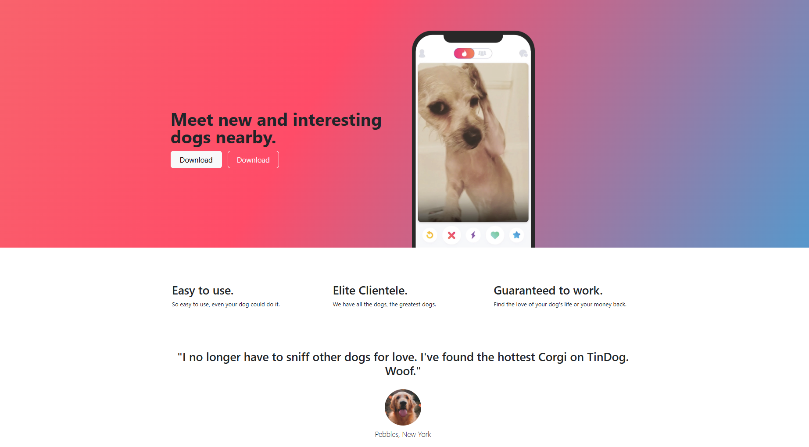
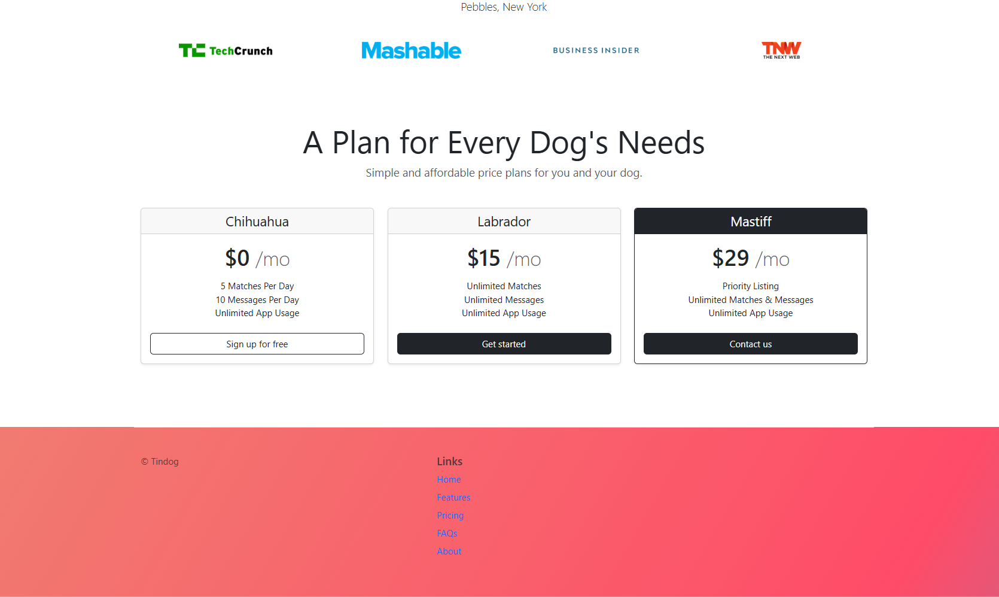

# 🐶 TinyDog Web  

A simple and responsive **TinyDog themed website** built using only **HTML and CSS**.  
This project demonstrates clean UI design, responsive layouts, and fundamental web development skills without using JavaScript or external frameworks.  

---

## 🌐 Live Demo  
🔗 [TinyDog Web](https://adityamahekar.github.io/tiny_dog/)  

---

## 🚀 Features  
- 🎨 Built entirely with **HTML & CSS**  
- 📱 Responsive and mobile-friendly design  
- 🐾 Minimal and clean UI  
- 🖼️ Showcases CSS styling and layout skills  

---

## 🛠️ Tech Stack  
- **Frontend**: HTML, CSS  
- **Deployment**: GitHub Pages  

---

## 📷 Gallery  

| TinyDog Page | TinyDog Page  |
|--------------|----------------|
|  |  |

---
